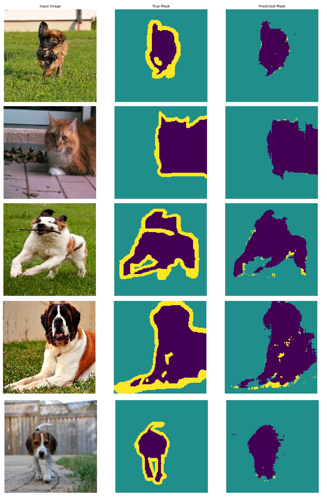

# Segmentation in tensorflow

Segmentation of images in tensorflow 2.6.0. Based on tutorial [Image segmentation](https://www.tensorflow.org/tutorials/images/segmentation).

## Running

Training:
```
$ python train.py
```
Prediction:
```
$ python predict.py
```

## Example prediction

