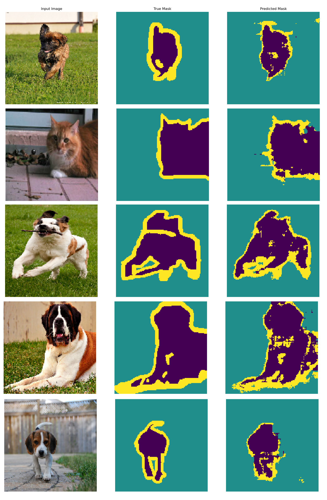

# Segmentation in tensorflow

Segmentation of images in tensorflow 2.6.0. Based on tutorial [Image segmentation](https://www.tensorflow.org/tutorials/images/segmentation).

## Running

Training:
```
$ python train.py
$ python train_weighted.py
```
Prediction:
```
$ python predict.py
$ python predict_weighted.py
```

## Statistics after 20 epochs of training
Non-weighted:
```
Epoch 20/20
57/57 [==============================] - 17s 297ms/step - loss: 0.2992 - accuracy: 0.8866 - f1_score: 0.6214 - val_loss: 0.3841 - val_accuracy: 0.8531 - val_f1_score: 0.6425
```
Weighted:
```
Epoch 20/20
57/57 [==============================] - 15s 270ms/step - loss: 0.0749 - accuracy: 0.8567 - f1_score: 0.6919 - val_loss: 0.3234 - val_accuracy: 0.8736 - val_f1_score: 0.7879
```

# Example predictions
## Non-weighted:


## Weighted:
